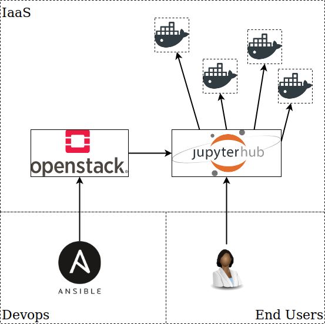

<h1 align="center"> Jukebox </h1> <br>

<p align="center">
    JupyterHub made easy.
</p>

## Table of Contents

- [Introduction](#introduction)
- [Features](#features)
- [Development](#development)

## Introduction

Jukebox is a simple way of deploying JupyterHub to your team's Openstack cloud. We have gone ahead and created playbooks and roles for ansible that will allow you to launch a VM, configure it with the required packages, deploy certificates, and finally allow your users to login with their google IDs!


<p align="center">
    
</p>

## Features

- Automated VM creation with Shade plugin for Ansible
- Automated certificate generated with Lets Encrypt and Certbot
- Installation and configuration of JupyterHub
    - Docker Spawner
    - Google OIDC Logins

## Tech Stack

- Docker
- Jupyter & JupyterHub
- Ansible
- Openstack
- Lets Encrypt
- Python

## Development

To get started, you can read the README in the ansible directory to properly configure your system(s).

To launch the playbook, you can begin with:

```bash
$ ansible-playbook -i config/hosts jupyter.yml
```


